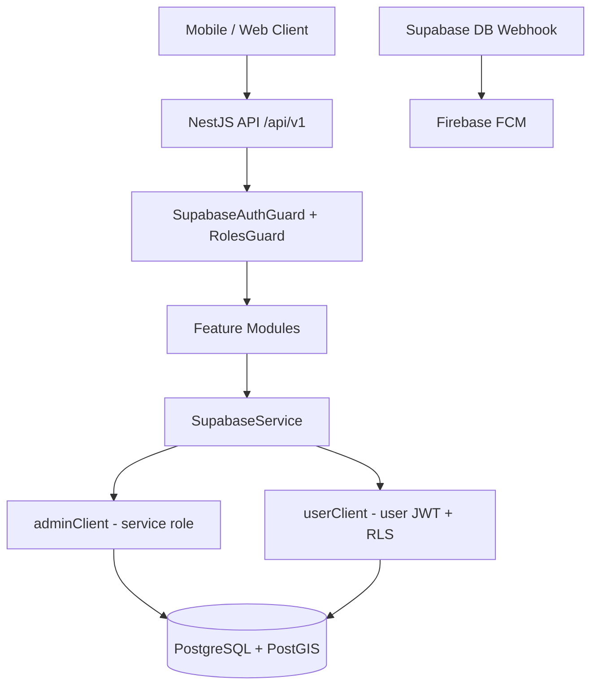

# MedConnect Backend — Project Overview

MedConnect is a pharmacy marketplace backend that connects **patients (users)**, **pharmacies**, and **admins**. Users search for medicines, find nearby pharmacies with stock, and reserve items for pickup. Pharmacies manage inventory and confirm pickups. Admins review pharmacy registrations and monitor system analytics.

---

## Tech Stack

| Layer | Technology |
|-------|------------|
| Framework | NestJS 11 (TypeScript) |
| Database | Supabase (PostgreSQL 15 + PostGIS) |
| Auth | Supabase Auth (JWT) |
| Push notifications | Firebase FCM |
| Caching | Redis (planned) |
| AI | OpenAI (chat + Excel import) |
| Queue | BullMQ + Redis (Excel import) |
| API docs | Swagger (`/docs` in non-production) |
| Logging | Pino (JSON structured logs) |

---

## Architecture



### Request flow

1. Client sends request with `Authorization: Bearer <jwt>` (except public routes).
2. **SupabaseAuthGuard** validates the JWT via Supabase and attaches `request.user = { id, token, role }`.
3. **RolesGuard** (when `@Roles()` is set) calls `get_my_role()` RPC and checks role + pharmacy approval status.
4. Controller delegates to service layer.
5. Service uses `SupabaseService.adminClient` (bypasses RLS) or `userClient(token)` (respects RLS).
6. **TransformInterceptor** wraps successful responses; **GlobalExceptionFilter** normalizes errors.

---

## Project Structure

```
src/
├── main.ts                    # Bootstrap, CORS, global pipes/filters/interceptors
├── app.module.ts              # Root module — imports all feature modules
├── config/                    # Environment config + Joi validation
├── database/
│   └── supabase.service.ts    # Supabase admin + user clients
├── common/
│   ├── guards/                # SupabaseAuthGuard, RolesGuard
│   ├── decorators/            # @CurrentUser, @Roles
│   ├── filters/               # GlobalExceptionFilter
│   ├── interceptors/          # Logging, Transform
│   └── types/                 # AuthUser, RPC result types
├── modules/
│   ├── auth/                  # Role resolution after login
│   ├── users/                 # User profile + FCM token
│   ├── pharmacy/              # Pharmacy registration + profile
│   ├── admin/                 # Admin dashboard operations
│   ├── drugs/                 # Drug search + nearby pharmacies
│   ├── inventory/             # Pharmacy stock management
│   ├── reservations/          # Medicine reservations + pickup
│   ├── notifications/         # In-app notifications + FCM
│   ├── webhooks/              # Supabase notification webhook
│   └── ai/                    # AI chat + Excel import (partial)
├── shared/logger/             # Pino logger wrapper
docs/                          # Setup guides
postman/                       # API collections for testing
supabase/migrations/           # SQL migrations
```

---

## User Roles

| Role | Source table | Description |
|------|-------------|-------------|
| `user` | `user_profiles` | Patient / customer |
| `pharmacy` | `pharmacy_profiles` | Pharmacist (must be `approved` for protected pharmacy routes) |
| `admin` | `admin_profiles` | System administrator |
| `unknown` | — | No matching profile or soft-deleted user |

Role is resolved via the `get_my_role()` Supabase RPC.

### Guard behavior

- **Public routes** — no guards (e.g. `POST /pharmacy/register`, `GET /drugs/search`).
- **Authenticated routes** — `SupabaseAuthGuard` only (e.g. `GET /pharmacy/me` so pending pharmacies can view status).
- **Role-protected routes** — `SupabaseAuthGuard` + `RolesGuard` + `@Roles('user' | 'pharmacy' | 'admin')`.
- **Pharmacy role** — `RolesGuard` also checks `pharmacy_profiles.status = 'approved'` before allowing access.

---

## Database Schema (Supabase)

### Core tables

| Table | Purpose |
|-------|---------|
| `user_profiles` | Patient profiles (`full_name`, `phone`, `fcm_token`, `deleted_at`) |
| `pharmacy_profiles` | Pharmacy profiles (`pharmacy_name`, `city`, `location`, `status`, `license_number`) |
| `admin_profiles` | Admin profiles |
| `drugs` | Medicine catalog (brand, generic, active ingredient, Arabic name) |
| `inventory` | Pharmacy stock (quantity, price, discount, expiry, batch) |
| `reservations` | User medicine reservations (`short_code`, `status`, price snapshot) |
| `notifications` | In-app notifications for users and pharmacies |
| `search_logs` | AI/search analytics |
| `ai_suggestions` | AI alternative drug suggestions |

### Key enums / constraints

- `pharmacy_profiles.status`: `pending` | `approved` | `rejected`
- `reservations.status`: `pending` | `confirmed` | `cancelled` | `expired`
- `inventory.status`: `active` | `inactive` | `expired`
- `pharmacy_profiles.location`: PostGIS `GEOGRAPHY(POINT)` — stored as `SRID=4326;POINT(lng lat)`

### Analytics views (Task 2)

- `mv_drug_search_analytics` — top searched active ingredients
- `mv_drug_purchase_analytics` — top purchased drugs from confirmed reservations

---

## API Modules

Base URL: `http://localhost:3000/api/v1`

### Auth

| Method | Path | Auth | Description |
|--------|------|------|-------------|
| POST | `/auth/role` | Bearer | Get current user role after login |

### Users (`@Roles('user')`)

| Method | Path | Description |
|--------|------|-------------|
| GET | `/users/me` | Get profile |
| PATCH | `/users/me` | Update profile |
| PATCH | `/users/me/fcm-token` | Register push notification token |

### Pharmacy

| Method | Path | Auth | Description |
|--------|------|------|-------------|
| POST | `/pharmacy/register` | Public | Register pharmacy (creates auth user + profile) |
| GET | `/pharmacy/me` | Bearer | Get pharmacy profile + status |
| PATCH | `/pharmacy/me` | Bearer | Update pharmacy profile |

### Admin (`@Roles('admin')`)

| Method | Path | Description |
|--------|------|-------------|
| GET | `/admin/pharmacies` | List pharmacies (filter: `?status=pending`) |
| POST | `/admin/pharmacies/:id/approve` | Approve pharmacy |
| POST | `/admin/pharmacies/:id/reject` | Reject pharmacy |
| GET | `/admin/users` | List users (cursor pagination) |
| DELETE | `/admin/users/:id` | Soft delete user |
| GET | `/admin/reservations` | List all reservations |
| GET | `/admin/analytics/overview` | System KPIs |
| GET | `/admin/analytics/drugs/searched` | Top searched drugs |
| GET | `/admin/analytics/drugs/purchased` | Top purchased drugs |

### Drugs (mostly public)

| Method | Path | Description |
|--------|------|-------------|
| GET | `/drugs/search?q=` | Search drugs by name/ingredient |
| GET | `/drugs/trending` | Trending medicines |
| GET | `/drugs/top-requested` | Most requested medicines |
| GET | `/drugs/:id/nearby?lat=&lng=&radius=` | Nearby pharmacies with stock |

### Inventory (`@Roles('pharmacy')`)

| Method | Path | Description |
|--------|------|-------------|
| GET | `/pharmacy/inventory` | List inventory |
| GET | `/pharmacy/inventory/near-expiry` | Items expiring in 30 days |
| POST | `/pharmacy/inventory` | Add item |
| PATCH | `/pharmacy/inventory/:id` | Update item |
| PATCH | `/pharmacy/inventory/:id/discount` | Update discount only |
| DELETE | `/pharmacy/inventory/:id` | Delete item |

### Reservations

| Method | Path | Role | Description |
|--------|------|------|-------------|
| POST | `/reservations` | user | Create reservation |
| GET | `/reservations/me` | user | List my reservations |
| DELETE | `/reservations/:id` | user | Cancel reservation |
| GET | `/pharmacy/reservations` | pharmacy | List incoming reservations |
| DELETE | `/pharmacy/reservations/:id` | pharmacy | Cancel reservation |
| POST | `/pharmacy/pickup` | pharmacy | Confirm pickup by short code |

### Notifications (`@Roles('user', 'pharmacy')`)

| Method | Path | Description |
|--------|------|-------------|
| GET | `/notifications/me` | List notifications |
| PATCH | `/notifications/:id/read` | Mark one as read |
| PATCH | `/notifications/read-all` | Mark all as read |

### Webhooks (internal)

| Method | Path | Auth | Description |
|--------|------|------|-------------|
| POST | `/webhooks/notification` | `x-webhook-secret` | Supabase INSERT trigger → FCM push |

---

## Response Format

### Success

```json
{
  "data": { ... },
  "meta": { "timestamp": "2026-06-12T05:24:32.513Z" }
}
```

### Error

```json
{
  "error": {
    "code": "FORBIDDEN",
    "message": "Access denied. Required roles: admin",
    "timestamp": "2026-06-12T05:24:32.513Z",
    "path": "/api/v1/admin/pharmacies"
  }
}
```

---

## Authentication

The backend does **not** issue tokens. Clients authenticate directly with **Supabase Auth**:

```
POST {SUPABASE_URL}/auth/v1/token?grant_type=password
Headers: apikey: {SUPABASE_ANON_KEY}
Body: { "email": "...", "password": "..." }
```

Use the returned `access_token` as `Authorization: Bearer <token>` for all protected API routes.

Typical client flow:

1. Login via Supabase Auth → get JWT
2. Call `POST /api/v1/auth/role` → get role (`user` | `pharmacy` | `admin`)
3. Route user to the correct app interface
4. Call role-specific endpoints

---

## Environment Variables

Copy `.env.example` to `.env`:

| Variable | Purpose |
|----------|---------|
| `SUPABASE_URL` | Supabase project URL |
| `SUPABASE_ANON_KEY` | Public anon key (user client) |
| `SUPABASE_SERVICE_ROLE_KEY` | Service role key (admin client — server only) |
| `SUPABASE_JWT_SECRET` | JWT verification secret |
| `SUPABASE_WEBHOOK_SECRET` | Webhook endpoint protection |
| `OPENAI_API_KEY` | AI chat + Excel import |
| `REDIS_URL` | Caching + job queue |
| `FIREBASE_SERVICE_ACCOUNT` | FCM push notifications (JSON string) |
| `CORS_ORIGINS` | Allowed frontend origins (comma-separated) |

---

## Supabase Setup Requirements

Before testing, ensure in Supabase SQL Editor:

1. **All tables exist** (see schema above)
2. **`get_my_role()` RPC** is created
3. **Service role grants** — the API uses `service_role` for all DB operations:

```sql
GRANT USAGE ON SCHEMA public TO service_role;
GRANT SELECT, INSERT, UPDATE, DELETE ON ALL TABLES IN SCHEMA public TO service_role;
GRANT USAGE, SELECT ON ALL SEQUENCES IN SCHEMA public TO service_role;
```

4. **PostGIS extension** enabled (for `pharmacy_profiles.location`)
5. **Admin test user** — create auth user + insert into `admin_profiles`
6. **Analytics views** — run `supabase/migrations/002_task2_analytics_views.sql` (optional for basic tests)

See [TASK2_SETUP.md](./TASK2_SETUP.md) for detailed setup steps.

---

## Getting Started

```bash
# Install dependencies
npm install

# Configure environment
cp .env.example .env
# Fill in Supabase keys and other values

# Start development server
npm run start:dev
```

- API: `http://localhost:3000/api/v1`
- Swagger: `http://localhost:3000/docs`

### Other scripts

| Command | Description |
|---------|-------------|
| `npm run build` | Compile TypeScript |
| `npm run start:prod` | Run compiled build |
| `npm run lint` | ESLint check |
| `npm run test` | Unit tests |

---

## Testing with Postman

Import the collections from `postman/`:

- `MedConnect-Task2.postman_collection.json` — Pharmacy + Admin endpoints
- `MedConnect.local.postman_environment.json` — Local environment variables

See [postman/README.md](../postman/README.md) for the recommended test flow.

---

## Code Conventions

- **Modules**: `controller` → `service` → `SupabaseService`, with DTOs using `class-validator` + Swagger decorators
- **DTOs**: snake_case field names matching DB columns (`full_name`, `fcm_token`, `license_number`)
- **Imports**: relative paths; `import type` for type-only imports
- **DB errors**: `supabase.throwFromPostgresError(error)` maps Postgres codes to HTTP exceptions
- **Formatting**: Prettier — single quotes, trailing commas

---

## Task Division (Team Ownership)

| Task | Modules | Owner focus |
|------|---------|-------------|
| 1 | Foundation, Auth, Users, Config, Guards | Shared infrastructure |
| 2 | Pharmacy, Admin | Registration, approval, analytics |
| 3 | Drugs, Inventory | Search, stock management |
| 4 | Reservations, Notifications, Webhooks, FCM | Booking flow + push |
| 5 | AI Chat, Excel Import | OpenAI assistant + bulk import |

---

## Related Docs

- [TASK2_SETUP.md](./TASK2_SETUP.md) — Pharmacy + Admin setup guide
- [postman/README.md](../postman/README.md) — API testing guide
- [.env.example](../.env.example) — Environment variable reference
